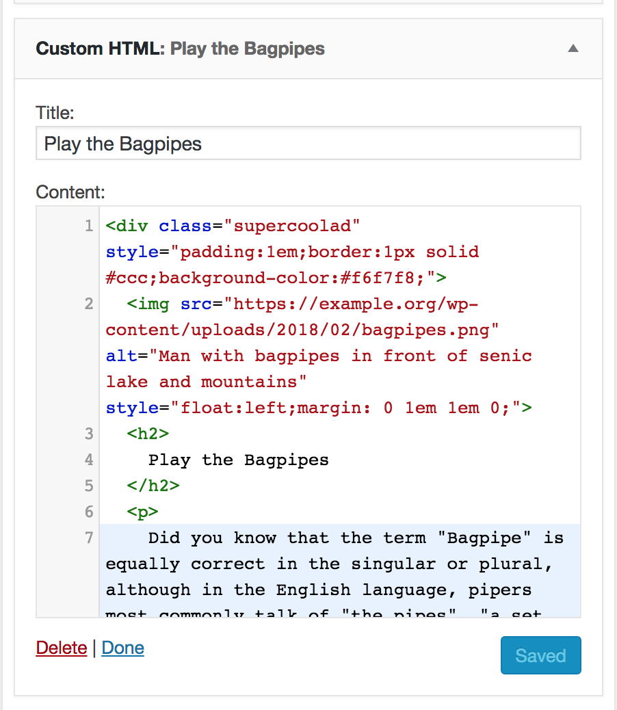

# Adding Super Cool Ads for Display in Posts

After you [configure the plugin](configuration.md) to set the number of paragraphs before each ad insertion, and the number of available ad insertions, visit **Appearance** > **Widgets** to create the ads themselves. You'll see a number of Inserted Ad Positions as Widget areas where you can place widgets. You can set the number of available Inserted Ad Positions in the [plugin options panel](configuration.md). Each Inserted Ad Position widget area can have one and only one ad.

To create an ad, begin by adding a Text Widget to one of the numbered Inserted Ad Positions:

You can then enter the content of the ad in the Text Widget. Note that you may include HTML, CSS, and JavaScript including iframed content from external ad sources. You can alternatively create your own ad content, and include inline styles for the content in the Text Widget:

In this case we've added our own markup, including inline styles defined in a div wrapping the ad. We've given this div the class of "supercoolad" so if your Largo child theme has styles for this in its CSS file, the class would be all you need. Or you can add to the div whatever class defines your ad styles.

With the above markup in the Text Widget in this Inserted Ad Position, the ad looks like this in the post:

## Setting How Ads are Displayed in Posts

The SCAIP provides great flexibility in how and where ads are displayed in posts. For details see [Ad Display Settings](display-settings.md).