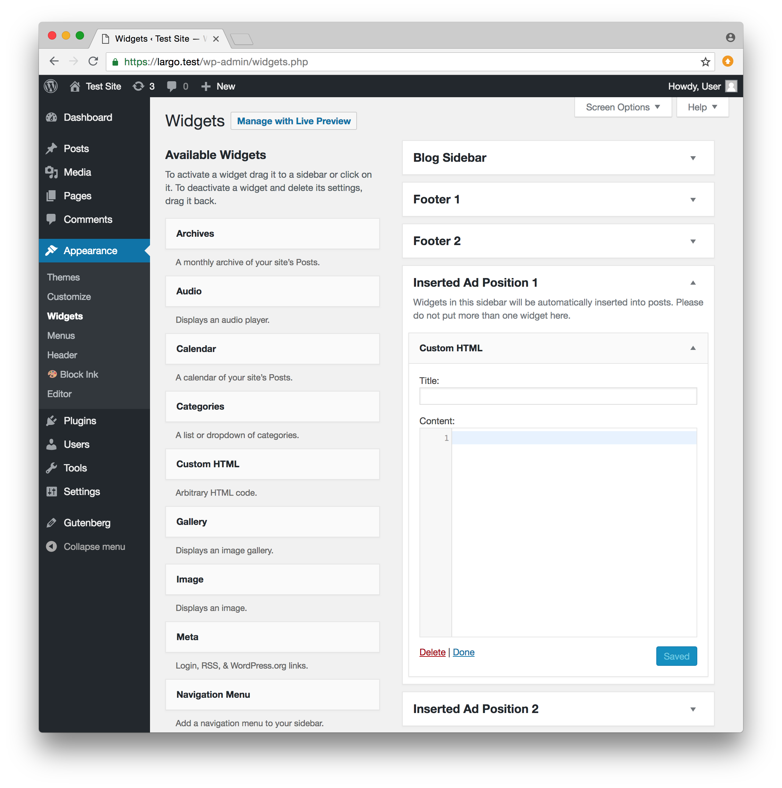

# Adding Ads for Display in Posts

After you [configure the plugin](configuration.md) to set the number of paragraphs before each ad insertion, and the number of available ad insertions, in the Dashboard go to **Appearance > Widgets** to create the ads themselves. You'll see a number of Inserted Ad Positions as widget areas where you can place widgets. You can set the number of available Inserted Ad Positions in the [plugin options panel](configuration.md). Generally speaking, each Inserted Ad Position widget area should have only one widget in it.

## Using ad plugins

If you are using an plugin such as [DoubleClick for WordPress](https://wordpress.org/plugins/doubleclick-for-wp/), which provides widgets for the display of ads, you can place that plugin's ad widgets in the Inserted Ad Positions.

## Manual ad creation

If you would like to manually create an ad, begin by adding a Custom HTML Widget to one of the numbered Inserted Ad Positions:



You can then enter the content of the ad in the Custom HTML Widget. Note that you may include markup including iframed content from external ad sources. You can alternatively create your own ad content, and include inline styles for the content in the Custom HTML Widget:


In this example we've added our own markup, including inline styles defined in a `div` wrapping the ad:

```html
<div class="supercoolad" style="padding: 1em; border: 1px solid #ccc; background-color: #F6F7F8;">

<h2>Play the bagpipes</h2>
<p>Did you know that the term "bagpipe" is equally in the singular or plural, although in the English language, pipers most commonly talk of "the pipes", "a set of pipes" or "a stand of pipes". Either way, there's nothing more welcome at holiday parties than a set of bagpipes. <a href="https://example.com/bagpipes/">Get yours today</a> and get a 10% discount on lessons. </p>
</div>
```

You can add CSS rules to your Largo child theme to apply styles to all inserted ads, which are contained in an `aside` with a class of `scaip`. (Note: This element can be changed through the application of filters; see [the developer documentation](./developers-shortcode-docs.md).

Or in the Text Widget for each ad, you can wrap the ad in a div with whatever class defines your existing ad styles. The example above uses the class `supercoolad`.

With the above markup in the Text Widget in this Inserted Ad Position, the ad looks like this in the post:


## Setting How Ads are Displayed in Posts

The SCAIP provides great flexibility in how and where ads are displayed in posts. For details see [Ad Display Settings](display-settings.md).
