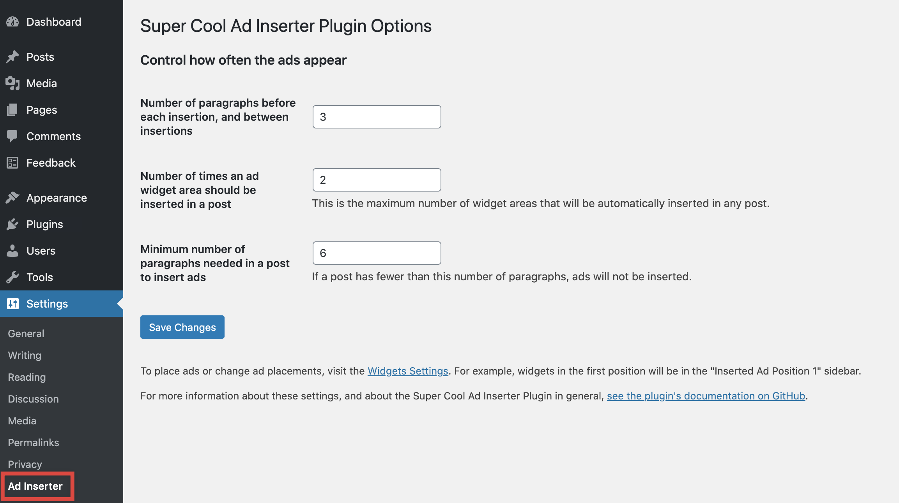
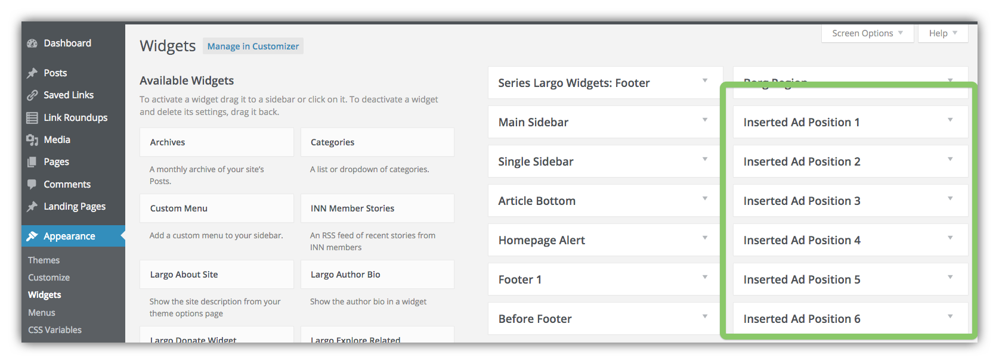

# Configuration

After installing the Super Cool Ad Inserter Plugin, a link to the Ad Inserter configuration panel will appear in the WordPress Settings menu:



The settings on this page control the placement and number of automatic ad zone insertions.

"**Number of paragraphs before first insertion**": The automatic ad inserter will wait this number of paragraphs before inserting the first ad zone.

"**Number of paragraphs between insertions**": After the first ad zone has been inserted, the automatic ad inserter will wait this number of paragraphs between inserting each subsequent ad zone.

"**Number of times the ad should be inserted in a post**": The absolute maximum number of ad zones that can be inserted in any post. This will set the number of Widget Areas available for ads in a post. So if you set it to 6, you'll have 6 Widget areas available for different ads:



Higher-numbered Inserted Ad Positions may not display in shorter posts. The minimum number of paragraphs needed in a post for all ads to display can be calculated with a simple formula. Using the theme's default settings:

```
    3   Number of paragraphs between insertions
  x 2   Number of times the ad should be inserted in a post
 -----
  + 4   Number of paragraphs before first insertion (if greater than number of paragraphs between insertions—otherwise, subtract the difference between the two)
 -----
   10
  + 1   A paragraph is needed after the last ad inserted
 -----
   11   Minimum number of paragraphs to display all ads
```

Note that you don't have to fill all the available Widget Areas with actual ads. If a position doesn't have any widgets, then it will remain blank on the post page. This provides additional flexibility for placing ads where you want without disrupting the flow of the post content.

Having an ad every three paragraphs until the end of the story might get very annoying to users, so this option allows you to balance the presentation of ads along with the post.

"**Minimum number of paragraphs needed in a post to insert ads**": If a post is very short, placing an ad in the middle of the content can be very annoying to readers. This setting allows you to prevent ads from appearing on posts with fewer paragraphs than the threshold.

## Create the Ads

After you define the number of paragraphs before each ad insertion, you can move on to [add the ads](adding-ads.md) themselves.
