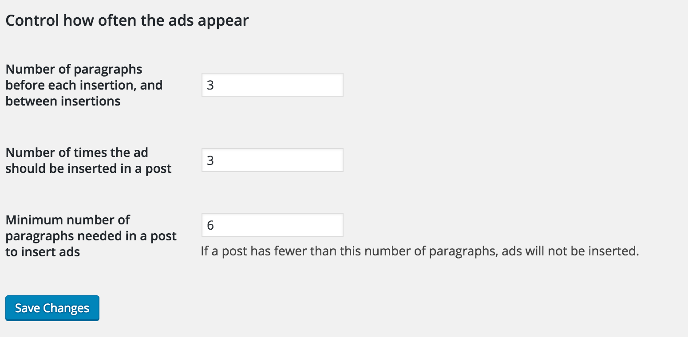

# Configuration

## The SCAIP settings page

The settings on this page control the placement and amount of automatic ad zone insertions.

"Number of paragraphs before each insertion, and between insertions": The automatic ad inserter will wait this number of paragraphs after the start of the article, insert the first ad zone, count his many more paragraphs, insert the second ad zone, and so on.

"Number of times the ad should be inserted in a post": The absolute maximum number of ad zones that can be inserted in any post is equal to the number of paragraphs in the story divided by the number of paragraphs between ad insertions, determined by the previous setting. Having an ad every three paragraphs until the end of the story might get very annoying, so this option allows you to set the maximum number of ad zones that will be automatically inserted in a post.

"Minimum number of paragraphs needed in a post to insert ads": If a post is very short, placing an ad in the middle of it doesn't look good, and annoys readers.

## The widget settings page

