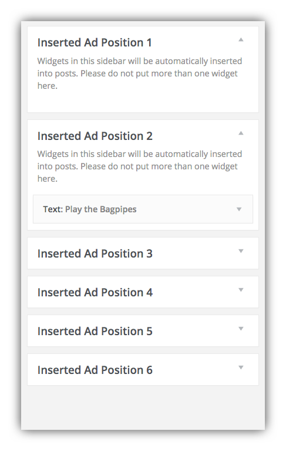

# Configuration

## The SCAIP settings page

The settings on this page control the placement and number of automatic ad zone insertions.

"**Number of paragraphs before each insertion, and between insertions**": The automatic ad inserter will wait this number of paragraphs after the start of the article, insert the first ad zone, count this many more paragraphs, insert the second ad zone, and so on.

"**Number of times the ad should be inserted in a post**": The absolute maximum number of ad zones that can be inserted in any post. This  will set the number of Widget Areas available for ads in a post. So if you set it to 6, you'll have 6 Widget areas available for different ads:

Note that you don't have to fill all the available Widget Areas with actual ads. If some don't have any ad content they'll remain blank on the post page. This provides additional flexibility for placing ads where you want without disrupting the flow of the post content. 
Having an ad every three paragraphs until the end of the story might get very annoying to users, so this option allows you to balance the presentation of ads along with the post.

"**Minimum number of paragraphs needed in a post to insert ads**": If a post is very short, placing an ad in the middle of the content can be very annoying to readers. This setting allows you to prevent ads from appearing on posts with fewer paragraphs than the threshold.

## The widget settings page

After you define the number of paragraphs before each ad insertion, and the number of available ad insertions, you can visit **Appearance** > **Widgets** to create the ads themselves. Begin by adding a Text Widget to one of the numbered Inserted Ad positions. 

You can then enter the content of the ad in the Text Widget. Note that you may include HTML, CSS, and JavaScript including iframed content from external ad sources. You can alternatively create your own ad content, and include inline styles for the content in the Text Widget:

In this case we've added our own markup, including inline styles defined in a div wrapping the ad. We've given this div the class of "supercoolad" so if your Largo child theme has styles for this in its CSS file, the class would be all you need. Or you can add to the div whatever class defines your ad styles.

With the above markup in the Text Widget in this Inserted Ad Position, the ad looks like this in the post:

### Ad Spacing using empty Inserted Ad Positions

You can add Text Widgets to each and every numbered Inserted Ad Position, and they will display every nth paragraph based on the number of paragraphs you defined in **Plugins** > **Ad Inserter**  settings. 

But sometimes you might want to protect larger blocks of paragraphs from getting interrupted by an ad. Let's say the ads are set to display every 3 paragraphs, which means the first ad will appear 3 paragraphs from the beginning of the post. As mentioned above, you can use an empty Inserted Ad Position to reserve that position without displaying an ad. In this case, we'd leave Inserted Ad Position 1 blank:

Note that we haven't even added an empty Text Widget to this Ad Position, but simply left it empty. On the post page, the first ad won't display until after 6 paragraphs:

