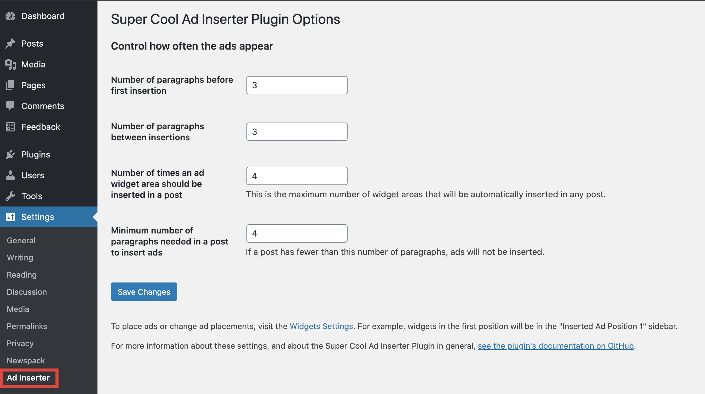

# Configuration

After installing the Super Cool Ad Inserted Plugin, a link to Ad Inserter configuration panel will appear in the WordPress Plugins menu:

The settings on this page control the placement and number of automatic ad zone insertions.

"**Number of paragraphs before each insertion, and between insertions**": The automatic ad inserter will wait this number of paragraphs after the start of the article, insert the first ad zone, count this many more paragraphs, insert the second ad zone, and so on.

"**Number of times the ad should be inserted in a post**": The absolute maximum number of ad zones that can be inserted in any post. This  will set the number of Widget Areas available for ads in a post. So if you set it to 6, you'll have 6 Widget areas available for different ads:

Note that you don't have to fill all the available Widget Areas with actual ads. If some don't have any ad content they'll remain blank on the post page. This provides additional flexibility for placing ads where you want without disrupting the flow of the post content. 
Having an ad every three paragraphs until the end of the story might get very annoying to users, so this option allows you to balance the presentation of ads along with the post.

"**Minimum number of paragraphs needed in a post to insert ads**": If a post is very short, placing an ad in the middle of the content can be very annoying to readers. This setting allows you to prevent ads from appearing on posts with fewer paragraphs than the threshold.

## Create the Ads

After you define the number of paragraphs before each ad insertion, you can move on to [add the ads](adding-ads.md) themselves.