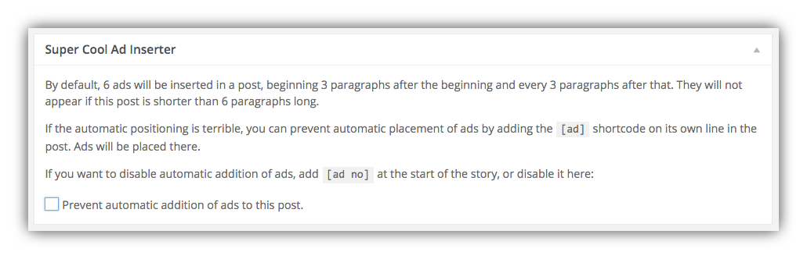

# Ad Display Settings

The Super Cool Ad Inserter provides lots of flexibility in how and where ads are placed within posts. By default, 6 ads will be inserted automatically in a post, beginning 3 paragraphs after the beginning and every 3 paragraphs after that. They will not appear if the post is shorter than 6 paragraphs. You can easily change these default settings for automatic insertion of ads in the [Ad Inserter Plugin Options panel](configuration.md).

## Prevent Automatic Insertion of Ads in a Post

By default once [configured](configuration.md) SCAIP will insert ads in every post. But you may have posts for which you want to exclude advertising. This is simple to do using the Super Cool Ad inserter post meta box that appears in the post editing page:

You can check the box to "prevent automatic addition of ads to this post," or alternatively you can add the shortcode `[ad no]` at the start of the story. In either case, no ads will appear in the post.

## Manual Ad Placement

You can override automatic placement of ads by inserting shortcodes in the body of the post wherever you want the ads placed. For example, to display the Inserted Ad Position 2 in a custom location in your post, you would use the following shortcode:

    [ad number="2"]

In this case the post will display the ad in Inserted Ad Position 2 wherever we placed the shortcode, and no other ads will automatically display. This allows you to have many Inserted Ad Positions available for some posts when needed, but display fewer ads with certain posts.

You can also reorder the display of Inserted Ad Positions by placing shortcodes for each wherever you want in the post.

## Ad Spacing Using Empty Inserted Ad Positions

You can add Text Widgets to each and every numbered Inserted Ad Position, and they will display every nth paragraph based on the number of paragraphs you defined in **Plugins** > **Ad Inserter**  [options](configuration.md). 

But sometimes you might want to keep the default automatic ad insertion but protect larger blocks of paragraphs from getting interrupted by an ad. Let's say the ads are set to display every 3 paragraphs, which means the first ad will appear 3 paragraphs from the beginning of the post. As mentioned above, you can use an empty Inserted Ad Position to reserve that position without displaying an ad. In this case, we'd leave Inserted Ad Position 1 blank:

Note that we haven't even added an empty Text Widget to this Ad Position, but simply left it empty. On the post page, the first ad won't display until after 6 paragraphs:

